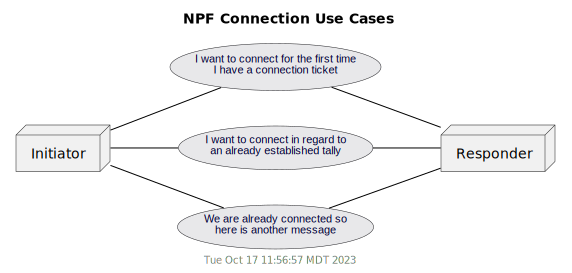
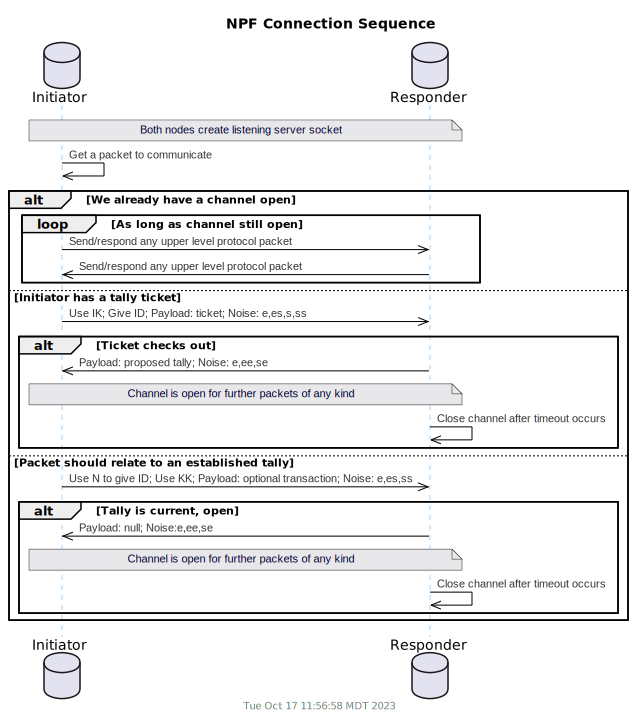
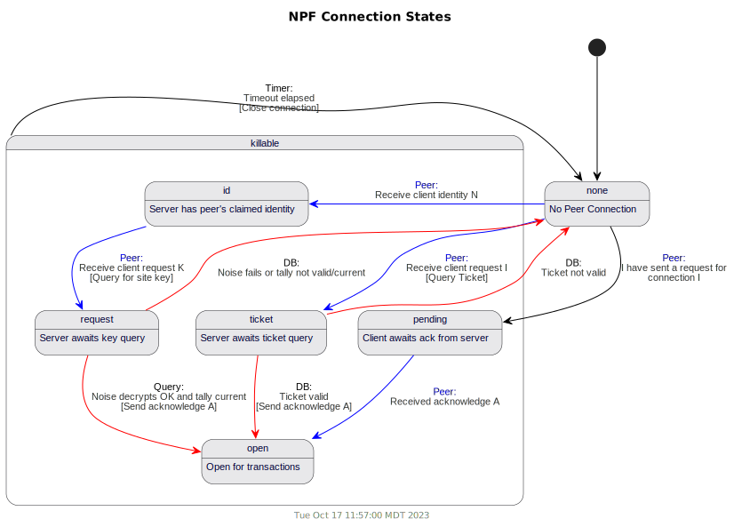

## Dialogs Between MyCHIPs Processes, Sites, Nodes, Users

### Peer to Peer Tally Request
Typically any first-time connection between two sites will be a request for a new tally.
A notable exception to this is if a site is also acting as a 
[Referee](/doc/Protocol.md#referee-queries) in which case it will be
expected to accept lift timeout queries from essentially anyone.

Connections associated with tally requests are conducted as follows:

- User A3 will request from his database a [tally ticket](/doc/Tallies.md#establishing-a-tally) granting access to his account.
  This also authorizes a peer site to establish a connection, absent key information.
  The ticket will be disclosed to User B1, via a reliable out-of-band pathway.
  For example, User B1 may scan a QR code on User A3's mobile device or User A3 may email or text the code to User B1.

<p align="center"></p>

- The ticket contains:
  - User A3's CID, the unique location identifier (```user_3@Site_A```) where to connect to do business with user A3;
  - An expiring, one-time token, authorizing connection without any other key information
    - The token will internally specify that it is for establishing a new tally
    - The token may optionally be limited to the specific CID of User B1
  - The token expiration date;
  - The public key of the issuing (A) site;

- Once in possession of the connection ticket,
  Site B connects (on behalf of B1) to site A.
  It sends a structure encrypted with the site A's public key, containing
    - The connection token;
    - The public key of site B;
    - An object (certificate) containing contact information about User B1 including;
      - CID
      - Public Key
      - Name, address, email, other identifying data

  If site A can decrypt this message, and the token is still valid, it will:
    - Finalize opening of the connection;
    - Consider the connection as the initial steps in the
      [Tally Initiation Sub-protocol](/doc/Protocol.md#tally-protocol);
    - Continue with key exchange and tally negotiation;

  If the initiation message fails, site A should silently close the connection
  and may opt to initiate defensive measures (such as firewall blocking) against
  possible [DOS](https://en.wikipedia.org/wiki/Denial-of-service_attack).

### Subsequent Peer to Peer Connection
  It is not generally allowable to accept a connection from a site unless the
  connection is related to a specific user on that site.
  For example, Site B may not connect to site A generically, nor may it connect to
  engage in a protocol on behalf of user A2.
  Rather Site B's business with Site A is limited to protocol messages related
  specifically to tallies (such as A3-B1) the two sites share in common.
  
  Furthermore, the tally should be properly signed by each of the parties and
  must include the public key of each user's site, indicating that the user
  authorizes the site to perform the lift protocol on behalf of the user.
  
  Having met these criteria, any site may connect to any other site at any time.
  The connection should be allowed and the message read, which is expected to
  belong to the standard set of [protocol messages](/doc/Protocol.md) and to
  pertain to a valid tally between users on the sites.
  
  Once a connection is open, it may be used for any tally shared by the two sites.
  So while an initial connecton is associated with a specific tally relationship,
  subsequent messages on the same channel may apply to other valid tallies
  between the sites.
  
  Messages may be sent by either side of the open connection at any time and for
  any valid reason and should be handled asynchronously and without regard to
  message order by each side of the connection.
  
  It expected that connections will be allowed to remain open for a time in
  expectation of other potential messages that may be forthcoming.
  
  Connections that have been open with no traffic for more than a specified 
  timeout may be closed.  It will be the responsibility of the responding
  peer (as opposed to the initiator) to decide if/when to close an idle
  socket connection.
    
### Noise Protocol Implementation
The [MyCHIPs Protocol](/doc/Protocol.md) describes a set of high level messages that
get passed back and forth between nodes in order to negotiate tallies, chits and lifts.

At a lower level, it is necessary for sites to connect to each other over a secure, encrypted channel.
MyCHIPs will use [Noise Protocol Framework](www.noiseprotocol.org)(NPF) to provide this security.
Two nodes may interconnect according to the following use pattern:



These patterns generate the following sequence of signals to establish an open communication channel over Noise Protocol:



For a first-time connection, NPF works great.
We can use the IK handshake pattern in which the initiator uses a ticket to authenticate and provide its own public key for the first time.

But for subsequent connections, there is a chicken-and-egg problem.
We want to use the KK pattern since both sides are already in possession of each other's static keys.
But we don't really know at first who is connecting on a given socket.

The connecting peer could provide this information in the first packet payload.
But NPF needs to be initialized in advance with both the pattern <b>and</b> each side's static keys.

This necessitates an initial one-way NPF packet being sent before any other in which the initiator declares its site identity.
This will use the N pattern which will keep the packet reasonably private and will provide sufficient information to the responder to invoke the appropriate key for subsequent packets.
If this initial packet is forged or modified, subsequent packets will not succeed because the shared key will not match.

To track this, packets will be prefixed with a single byte header as follows:
- I: Initial connection request from initiator to responder containing a connection ticket.
- N: One way transmission from initiator to responder, declaring initiator's site id (```address@port```).
- K: Subsequent connection request (sent immediately after N packet) .
- A: Noise acknowledge packet from responder to initiator, completes noise handshake.
- T: Regular transmission packet over established, encrypted channel.

Each connection should then in one of the following states:



The pending state is represented by a peer who initiates contact with a currently disconnected server.
The ticket and request states represent a server responding to a client connection request.

As a result, it is possible that two peers might initiate a connection to each other at about the same time.
This could result in two channels getting opened up between the two hosts.
While this is not optimal, it should not pose a problem as long as the communication module does not make any assumptions that it cannot happen.


## Old Material Warning!
The balance of this document dates back to Aug 2018 so information may be outdated.

### Initialization/administration of site
- Upon first launch of the admin server:
  - If database not built, build it (need to finish wyseman command to do this from the app)
  - Execute any initialization scripts
  - Establish a site key, if one doesn't already exist

- The admin server should respond to the following commands (GUI/CLI):
  - Create a new user
  - Dump user data to json file
  - Load a new user from a json dump file
  - Edit user data, status
  - Issue user initial connection ticket
  - Create a new site key
  - Encrypt the site key (specify a new pass phrase)
  - Start peer server (requires the key pass phrase)
  - Stop peer server
  - Put a user (or the whole site) into lockdown mode
  - Edit site configuration defaults

### Initialization of keys between the user's mobile device and the user's site
- Initially, the service provider must set up a user account on its site
  This will include name, address, contact info, etc.
  But the provider should not know the user's private key information.
  This should eventually be kept on the mobile device.
  
  For initial prototyping, we may store the user's encrypted private key on the site server.
  It can be transmitted to the client, decrypted and used there to sign transactions.

- To get an initial connection, the provider admin creates a user ticket
  The ticket contains:
  - An Internet address, and port at which to connect to the site
  - A unique token, authorizing connection for this user without any key information
  - The site's public key
  Internally, the ticket has an expiration date, and the user's CID.
  But the published ticket does not contain either of these items.
  The user must know his own CID, and remember when the ticket expires.

- The mobile app reads the ticket information, storing the site's public key.
  It then connects on the specified address and port using SSL.
  The connection is configured to validate the server identity only.
  In other words, anyone with the ticket can connect.
  The client sends a structure (SSL encoded) containing:
    - The token
    - The user's CID
    - The user's public key (create one if it doesn't already exist)
  If the site can decode this structure, and the token and CID are valid, the server
    - Stores the user's public key,
    - Returns a success code: OK,
    - Closes the connection
  Otherwise, it returns nothing, refusing to read further information on the connection.
  Regardless, the token is invalidated and so can no longer be used.

### Normal connection between the user's mobile device and the user port server
- Connection is initiated by the mobile app
- Once connected, the app can query periodically for status updates, if desired.
- It might also open a secure socket on which to receive asynchronous alarms.
- Otherwise, if the site has an alarm for the user, this is sent via email/text
- Having received an alarm, the user can connect by launching the trusted app
  and query for status updates to determine the problem.

- The mobile app will connect at the private address and port
- It will send the CID of the user connecting
- The SSL library will then validate the user using his public key, already known

- Once a private, secure connection has been achieved, 
  The server will enter a command interpretor mode:
  It will receive command structures,in json format, and
  return status structures, also in json format.

- The connection will remain open until one of the sides closes it.
  Normally the mobile app will do the closing.
