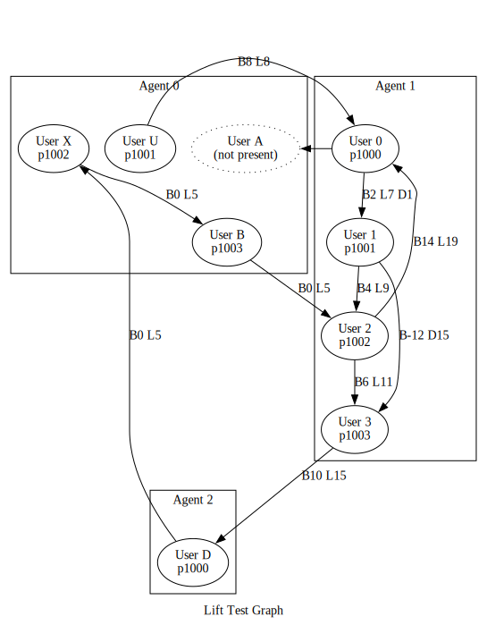

<div style="display: flex; justify-content: space-between;">
  <a href="README.md#contents">Back to Index</a>
  <a href="work-upgrade.md">Next</a>
</div>

## Testing Environment

### Mocha Tests
There is a suite of regression tests implemented in test/mocha

You can run the entire test suite with:
```
  npm test
```

That will run all the tests included in test/mocha/all.js.

This is designed to work on Linux and assumes you have an instance of PostgreSQL 
and Mongo running at the expected ports (see test/mocha/common.js and test/settings.js).

More recently, the tests should also run on a MacOS (or possibly Windows) system as 
long as docker and docker-compose are accessible.
The test suite will attempt to launch Postgres and Mongo containers as needed for its own use.

For running isolated tests, something like this should work:
```
  cd test/mocha
  npx mocha sch-crypto
```

Keep in mind that many of the tests are dependent upon other tests having been previously run.
They expect the database to be a certain state before they begin.
See the notes at the beginning of each test.
For example, you may have to run a certain string of tests in just the right order to get valid results:
```
  npx mocha impexp testusers models
  npx mocha impexp user2 sch-path sch-route route sch-lift.js
```

When debugging a failed test, this procedure may help:
  - Find a command like the above that will re-create the smallest possible
    set of tests up to the failing module but excludes all later test modules.
  - Then go into the module and put a beginning comment (/*) just after the
    failed test.  This will disable all later tests in that module.
    There is a dummy comment (/* */) near the end of the file to serve as the
    end of your temporary comment block.
  - Set debugging mode with: export NODE_DEBUG=debug
  - Establish a log watch with: ./watch <module_name>
  - Un-comment the debug lines for that test and
  - Now re-run the test command so only the last test fails.
  - Examine the debug output to try to determine what is failing

If you are debugging logic in the database schema, you may need to:
  - Insert debugging commands in stored procedures using "raise notice" (see existing examples)
  - Rebuild the schema file:
    - cd mychips/schema
    - make schema
  - Drop the test database if necessary: dropdb -U admin mychipsTestDB
  - Make sure notices are enabled in /path/to/pgsql/data/postgresql.conf
    - log_min_message = notice
  - Monitor the Postgres log file: tail -f /path/to/pgsql/data/log/postgresql.log/
  - Repeat the test: npx mocha testfile.js

## Unit Testing Paths, Routes and Lifts
For testing that involves pathways between nodes, the test suite will create
a simplified network of tallies as follows:

[](uml/test-paths.svg)

This provides examples of many of the basic scenarios that may occur when
discovering and/or using pathways and routes for credit lifts.

### Bug Fixing Workflow
When fixing bugs in MyCHIPs, please observe the following workflow pattern:
  - Re-create the bug behavior.
  - Run the regression suite to see if the bug is exposed (probably not).
  - Devise a test that exposes the bug.
  - Add your new test to the suite.
  - Proceed to fix the bug.
  - Repeat the entire test suite regularly as you work to make sure you don't break something else in the process.
  - Make sure the entire test suite passes before you submit a pull request (or push/merge).

<div style="display: flex; justify-content: space-between;">
  <a href="README.md#contents">Back to Index</a>
  <a href="work-upgrade.md">Next</a>
</div>
